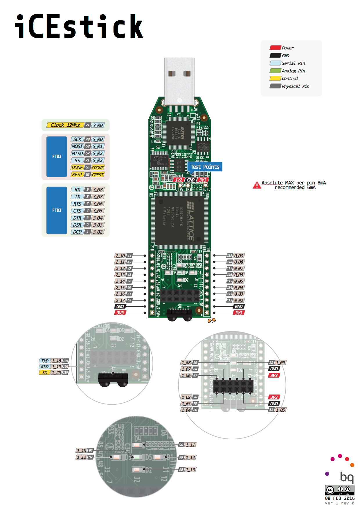

# FPGA to HERO
A progressive Verilog learning repository for FPGA development on the **Lattice iCE40HX1K** using the **ICEStick Evaluation Board**. The long-term goal is to eventually create a soft RISC-V core.

## Project Structure

### Learning Modules (Progressive Complexity)
- **00_led_example/** - Basic LED blink and sequential control
- **01_and_gate/** - Combinational logic gates
- **02_adder/** - Arithmetic circuits
- **03_counter/** - Sequential logic with clock prescaling (12 MHz → 1 Hz)
- **04_fsm_moore/** - Moore Finite State Machines

## APIO - Build & Synthesis Tool

Using APIO to build, synthesize, test, and upload designs.

### Installation
Follow [Getting Started](https://fpgawars.github.io/apio/docs/installing-apio-cli/#install-using-a-file-bundle_2)

### Basic Commands
```bash
apio create -b icestick    # Initialize new project
apio build                 # Synthesize design
apio sim                   # Run simulation
apio upload                # Program FPGA board
apio                       # View full help
```
## AI Agent

If using an AI copilot, see **ai_OS/README.md** for comprehensive guidance on:
- Creating new projects
- Verilog design help
- Design patterns and best practices
- Board-specific configurations

## Documentation & Resources
- **docs/icestickusermanual.md** - ICEStick user manual (converted from PDF)
- **docs/iCE40LPHXFamilyDataSheet.md** - FPGA datasheet (converted from PDF)
- **ai_OS/template_project/** - Reference structure for new projects
- **ai_OS/HANDOVER.md** - Comprehensive guide for AI agents and new project creation




## References

- [Introduction to FPGA YouTube Series](https://www.youtube.com/watch?v=lLg1AgA2Xoo&list=PLEBQazB0HUyT1WmMONxRZn9NmQ_9CIKhb)

## WSL Configuration

If using WSL, configure USB passthrough:
https://learn.microsoft.com/en-us/windows/wsl/connect-usb